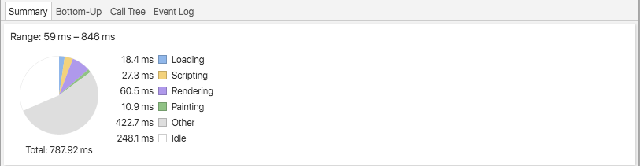
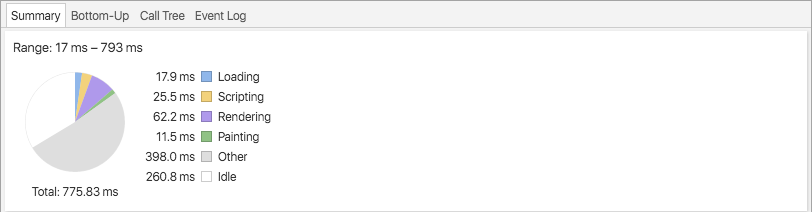

# LookLive server

The project you're looking at is an [express.js](http://expressjs.com) project. You'll use it to get set up a development environment where you're
going to optimize the way this project works. In it's current state, the css is messy, the rendering isn't modern and
overall the product is boring and not efficient. It's up to you to fix this and improve it.

## Getting started

### Step 1 - clone the repo
Github provides some instructions for this and we're assuming that you know how to clone this repo. If you're not sure,
don't hesitate to raise your hand now and ask.

### Step 2 - install dependencies
In order to run the server you'll need to install express.js and it's dependencies. In order to do this, open up a 
terminal and navigate to your project folder (for example `cd ~/Projects/looklive-server`). When you've done this, type
this command to run the instal:

```
npm install
```

That should get you setup.

### Step 3 - running the server
To run the server, stay at the 'root' of your project folder and type:

```
npm start
```

That will get the server to run on port 3000. If you go to [http://localhost:3000](http://localhost:3000) in your browser
you should see an overview page.

## The api

This project comes with a simple API. All you need to know for now is that there's three endpoints:

* `/api/feed/` <- returns a feed of appearances
* `/api/appearance/:uuid` <- returns a single appearance, more detailed than in the feed. Replace `:uuid` with the 
appearance id.
* `/api/product/:uuid` <- returns a single product, including similar and bargain products. Replace `:uuid` with the 
product id.

The API returns JSON (for now).

<h1>Service worker</h1>

<h2>Speed without service worker</h2> 



<h2>Speed with service worker</h2>



<h1>Progressive web apps research</h1>

<p>
    
    A progressive web app is an app that has native app like user experience. To accomplish this native app like user experience a web app must use modern web capabilities to deliver this user experience. Alex Russell (Google engineer) first espoused progressive web apps in june 2015. 
</p>

<p>

    Progressive web apps (from this point refered to as PWA) don't require any installation on a device, but is able to have an icon on the home screen. 
    Actually PWA's live as a tab in your browser. The more a user visits this URL the more functionality it will get. The PWA can see how manny times you haved used the PWA and after a certain while it can send you a notification to pin the PWA to the home screen. At this point the PWA will get more native app like capabilities. From sending notifications to offline usage. The offline usage is possible because of a service worker (from this point refered to as SW). A SW is one of the three things a web app needs to become a PWA. The remaining two are: the PWA has to run on HTTPS, and you have to Create an app manifest file, which specifies a bunch of information about your app such as its name.
    
    Progressive web apps are: 
    
    <ul>
        <li><b>Progressive</b> - Work for every user, regardless of browser choice because they're built with progressive enhancement as a core tenet.</li>
        <li><b>Respinsive</b> - Fit any factor: desktop, mobile, tablet, or whatever is next.</li>
        <li><b>Connectivity independent</b> - Enhanced with service workers to work offline or on low quality networks.</li>
        <li><b>App-like</b> - Feel like an app to the user with app-style interactions and navigation because it's built on the app shell model.</li>
        <li><b>Fresh</b> - Always up-to-date thanks to the service worker update process.</li>
        <li><b>Safe</b> - Served via HTTPS to prevent snooping and ensure content hasn’t been tampered with.
        <li><b>Discoverable</b> - Are identifiable as “applications” thanks to W3C manifests and service worker registration scope allowing search engines to find them.</li>
        <li><b>Re-engageable</b> - Make re-engagement easy through features like push notifications.</li>
        <li><b>Installable</b> - Allow users to “keep” apps they find most useful on their home screen without the hassle of an app store.</li>
        <li><b>Linkable</b> - Easily share via URL and not require complex installation.</li>
    </ul>
    
    <a href="https://developers.google.com/web/progressive-web-apps" target="_blank">source</a> 
    <a href="http://developer.telerik.com/featured/what-progressive-web-apps-mean-for-the-web/" target="_blank">source</a> 
    <a href="http://arc.applause.com/2015/11/30/application-shell-architecture/" target="_blank">source</a> 
</p>

#Task managers research 

##Grunt, Gulp, Broccoli and Mimosa 

To make sure what the best task manager could be for me I searched the web for some articles. 

Basicly a taskmanagers runs tasks for you that could be autoprefixing files, or minify files, but which one is the best, or better said comes closes to my needs. 

Broccoli and Mimosa are quite new to the web and after reading a article a found out that broccoli and mimosa aren't so well supported yet. Broccoli is still in beta so that explains why their support isn't like the support grunt or gulp can offer. 

Mimosa is also a good taskmanager but in the article I read the writer came upon some errors, so that one also falls off for me. 

Then there are Gulp and Grunt. Both well supported and well used troughout the web, but which one is better. 

##Gulp vs. Grunt

The main difference between gulp and grunt is performance and that's just what I'm looking for. 
Gulp is faster than Grunt because gulp doesn't make temp files, but uses node streams. Let me give a short example. 

You want to compile and minify your sass file. Grunt first compiles the file and then makes a temporary file, that temporary file is used by the autoprefixer and the final product is then written to the destination file. 

Gulp doesn't make temporary files, so gulp doesn't have to store a temp file. They just skip this part. Gulp compiles the file sends it to the prefixer and that rewrites it to the destination file. 

## Is Gulp really better? 

Gulp and Grunt are both good task managers and it's true that Grunt is better supported and has more users just because they've been around longer than Gulp. Also Grunt has more plugins than Gulp, but it is not to be forgotten that Gulp can also use plain node plugins (Thanks to Declan Rek for providing me with this info). So it really depends on the project that you're going to do, which one you should use. Because I want to gain speed with my project Gulp is the taskmanager for me at this moment. 

[Source](http://jpsierens.com/task-runners-a-comparison-between-grunt-gulp-broccoli-and-mimosa/)
[Source](http://www.hongkiat.com/blog/gulp-vs-grunt/)


