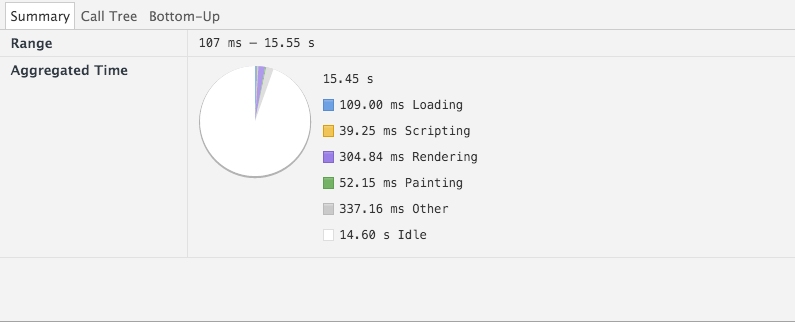

# LookLive server

The project you're looking at is an [express.js](http://expressjs.com) project. You'll use it to get set up a development environment where you're
going to optimize the way this project works. In it's current state, the css is messy, the rendering isn't modern and
overall the product is boring and not efficient. It's up to you to fix this and improve it.

## Getting started

### Step 1 - clone the repo
Github provides some instructions for this and we're assuming that you know how to clone this repo. If you're not sure,
don't hesitate to raise your hand now and ask.

### Step 2 - install dependencies
In order to run the server you'll need to install express.js and it's dependencies. In order to do this, open up a 
terminal and navigate to your project folder (for example `cd ~/Projects/looklive-server`). When you've done this, type
this command to run the instal:

```
npm install
```

That should get you setup.

### Step 3 - running the server
To run the server, stay at the 'root' of your project folder and type:

```
npm start
```

That will get the server to run on port 3000. If you go to [http://localhost:3000](http://localhost:3000) in your browser
you should see an overview page.

## The api

This project comes with a simple API. All you need to know for now is that there's three endpoints:

* `/api/feed/` <- returns a feed of appearances
* `/api/appearance/:uuid` <- returns a single appearance, more detailed than in the feed. Replace `:uuid` with the 
appearance id.
* `/api/product/:uuid` <- returns a single product, including similar and bargain products. Replace `:uuid` with the 
product id.

The API returns JSON (for now).

    <body>
        <h1> Testing performance Looklive server </h1> 
        <article>
            <p>All these test were done with the throttling at a regular 4g speed. </p>
        </article>
        <h2>Deleted some font weights from the custom google fonts in HTML.</h2>
        <h3>Before</h3>
        
        <h3>After</h3>
        
        <h2>Rewrote the HTML of the layout page to be semantic and 
            efficiently</h2>
        <h3>Before</h3>
        
        <h3>After</h3>
        
        <h2>Deleted the header image as a background, used srcset instead and reduced the size of the images used in srcset</h2>
        <h3>Before</h3>
        
        <h3>After</h3>
        
        <h2>The loading time with jquery turned off</h2>
        <h3>Before</h3>
        
        <h3>After</h3>
        
        <h2>Rewrote the app.js script to do the same, but without the use of jquery</h2>
        <p>Special thanks to Emiel Zuurbier</p>
        <h3>Before</h3>
        
        <h3>After</h3>
        
        <h2>Rewrote the css to be flexbox</h2>
        <h3>Before</h3>
        
        <h3>After</h3>
        
        <h3>This is the result speed of the new website with no throttling</h3>
        
    </body>
</html>
